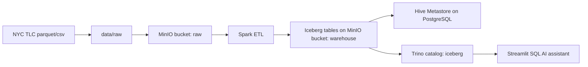

# Data Lakehouse и BI-ассистент

Локальный проект для сдачи: MinIO как S3-compatible storage, Hive Metastore на PostgreSQL, Iceberg-таблицы, Trino для SQL-доступа, Spark для загрузки/обработки данных и Streamlit SQL AI assistant поверх аналитических витрин.

## Датасет

Используется публичный NYC TLC High Volume For-Hire Vehicle Trip Records. Это помесячные Parquet-файлы с поездками, временем, зонами посадки/высадки, тарифами, чаевыми и выплатами водителям. Несколько месяцев дают датасет порядка гигабайта и больше; полный 2024 год существенно больше.

Источник: [NYC TLC Trip Record Data](https://www.nyc.gov/site/tlc/about/tlc-trip-record-data.page).

В текущем варианте проекта выбран набор `fhvhv_tripdata_2024-01.parquet`, `fhvhv_tripdata_2024-02.parquet`, `fhvhv_tripdata_2024-03.parquet`. Детали выбора и структуры данных вынесены в [docs/dataset.md](docs/dataset.md).

## Архитектура



## Быстрый запуск

### Что нужно перед запуском

- Docker Desktop или совместимый Docker Engine с `docker compose`.
- Три parquet-файла `fhvhv_tripdata_2024-01.parquet`, `fhvhv_tripdata_2024-02.parquet`, `fhvhv_tripdata_2024-03.parquet` в корне `digdata` или уже подготовленная раскладка в `data/raw/fhvhv`.
- API key OpenAI или Gemini для свободных вопросов к данным. Без ключа проект тоже запускается: `LLM_PROVIDER=mock` выдаёт SQL для подготовленных demo-сценариев и позволяет показать интеграцию ассистента с Trino.

### Первый запуск

1. Перейти в директорию проекта:

```bash
cd /path/to/digdata
```

2. Скопировать переменные окружения:

```bash
cp .env.example .env
```

Для офлайн-демо оставьте `LLM_PROVIDER=mock`. Для GenAI-демо задайте, например, `LLM_PROVIDER=openai` и `OPENAI_API_KEY`.

3. Поднять lakehouse:

```bash
make up
```

4. Подготовить raw-данные. По умолчанию скачиваются январь-март 2024 и справочник зон:

```bash
make download

```

Если три выбранных parquet-файла уже лежат в корне `digdata`, команда не скачивает их повторно. Она оставляет эти файлы на месте и докачивает только отсутствующий справочник зон в `data/raw/zones`.

Для полного года:

```bash
MONTHS="01 02 03 04 05 06 07 08 09 10 11 12" make download
```

5. Загрузить raw AS IS в MinIO:

```bash
make upload
```

Загрузчик понимает оба размещения parquet-файлов: готовую раскладку `data/raw/fhvhv/year=.../month=...` и файлы `fhvhv_tripdata_YYYY-MM.parquet` в корне проекта.

6. Загрузить raw в Iceberg и сформировать витрины:

```bash
make etl
```

На первом прогоне Spark читает parquet-файлы из MinIO, создаёт Iceberg-таблицы `raw`, `curated`, `analytics` и пересобирает аналитические витрины. Цель `make etl` запускает Spark job через standalone master, поэтому во время выполнения приложение видно в Spark Master UI.

7. Проверить Trino:

```bash
make smoke
```

8. Открыть интерфейсы:

- MinIO: http://localhost:9001, логин `minioadmin`, пароль `minioadmin`
- Trino: http://localhost:8080
- Spark Master UI: http://localhost:8081
- BI-ассистент: http://localhost:8501

### Что делать после запуска

1. В MinIO показать bucket `raw` и файлы `nyc_taxi/fhvhv/year=2024/month=...`: это загрузка raw AS IS.
2. В Trino или командой `make smoke` показать Iceberg-схемы и созданные витрины.
3. Открыть BI-ассистента на `http://localhost:8501`, задать вопрос на русском или английском и показать:
   - сгенерированный SQL;
   - результат SQL из Trino;
   - текстовый ответ по данным.
4. Для ручной проверки выполнить SQL из файла [sql/02_demo_queries.sql](sql/02_demo_queries.sql), например:

```bash
./scripts/trino_query.sh "SELECT * FROM iceberg.analytics.mart_top_routes ORDER BY trip_count DESC LIMIT 10"
```

5. Для demo-прогона по сценарию использовать [docs/demo_script.md](docs/demo_script.md).

### Повторный запуск и остановка

Если контейнеры уже созданы, обычно достаточно:

```bash
make up
make smoke
```

Остановить контейнеры, сохранив MinIO и Hive Metastore volumes:

```bash
make down
```

Полностью удалить контейнеры и накопленные lakehouse-данные:

```bash
make clean
```

## Что создается в Iceberg

Сырые и нормализованные таблицы:

- `iceberg.raw.fhvhv_trips`
- `iceberg.raw.taxi_zones`
- `iceberg.curated.fhvhv_trips_enriched`

Аналитические витрины:

- `iceberg.analytics.mart_daily_zone_revenue` - выручка и поездки по дням и зонам.
- `iceberg.analytics.mart_base_monthly_kpi` - KPI по dispatching base за месяц.
- `iceberg.analytics.mart_top_routes` - популярные маршруты между зонами.
- `iceberg.analytics.mart_hourly_demand` - спрос по часам и borough.
- `iceberg.analytics.mart_airport_trips` - аэропортовые поездки.

## Проверенный прогон

На текущей конфигурации загружены NYC TLC FHVHV за январь-март 2024:

- raw MinIO bucket: 4 объекта, 1.3 GiB.
- `iceberg.raw.fhvhv_trips`: 60,303,866 строк.
- `iceberg.curated.fhvhv_trips_enriched`: 60,301,548 строк.
- `iceberg.analytics.mart_daily_zone_revenue`: 23,420 строк.
- `iceberg.analytics.mart_base_monthly_kpi`: 6 строк.
- `iceberg.analytics.mart_top_routes`: 62,093 строки.
- `iceberg.analytics.mart_hourly_demand`: 146 строк.
- `iceberg.analytics.mart_airport_trips`: 22,745 строк.

Если Docker Desktop ограничен 4 ГБ RAM и standalone ETL не помещается по ресурсам, запустите локальный режим:

```bash
make etl-local
```

В этом режиме Spark выполняет job в `local[1]`; данные и Iceberg-витрины формируются так же, но приложение не регистрируется в standalone Spark Master UI.

## Примеры вопросов для демо

- Какая зона посадки дала максимальную выручку за январь 2024?
- Покажи топ-10 маршрутов по количеству поездок.
- В какие часы самый высокий спрос в Manhattan?
- Сравни базы по средней выручке на поездку.
- Сколько аэропортовых поездок было по дням?

## Семантический слой

Описание таблиц, колонок, метрик и синонимов лежит в [assistant/semantic_layer.yaml](assistant/semantic_layer.yaml). Ассистент использует его при генерации SQL, поэтому новые витрины можно добавлять конфигурацией без изменения промпта.

## Оценка качества

Файл [eval/questions.yaml](eval/questions.yaml) содержит контрольный набор вопросов. Скрипт [eval/llm_judge.py](eval/llm_judge.py) запускает assistant, выполняет SQL и может использовать другую LLM как судью, если задан `JUDGE_OPENAI_API_KEY`.

## Технологические ссылки

- [Trino Iceberg connector](https://trino.io/docs/current/connector/iceberg.html)
- [Trino S3 file system support](https://trino.io/docs/current/object-storage/file-system-s3.html)
- [Apache Iceberg Spark configuration](https://iceberg.apache.org/docs/latest/spark-configuration/)
- [Apache Hive Docker setup](https://hive.apache.org/docs/latest/admin/setting-up-hive-with-docker/)
# bigdata_NYC
